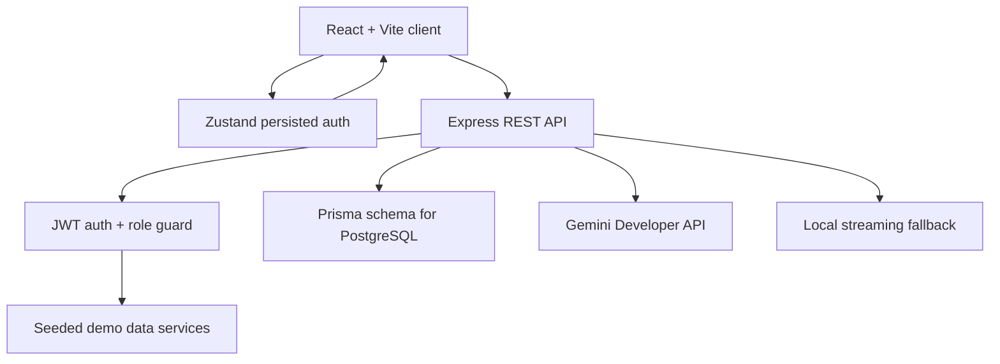
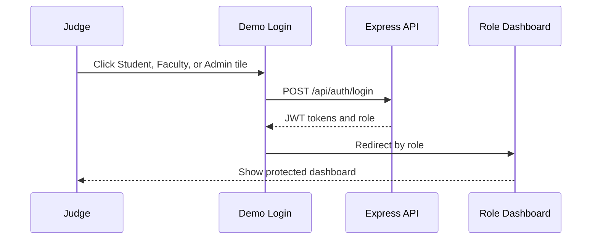
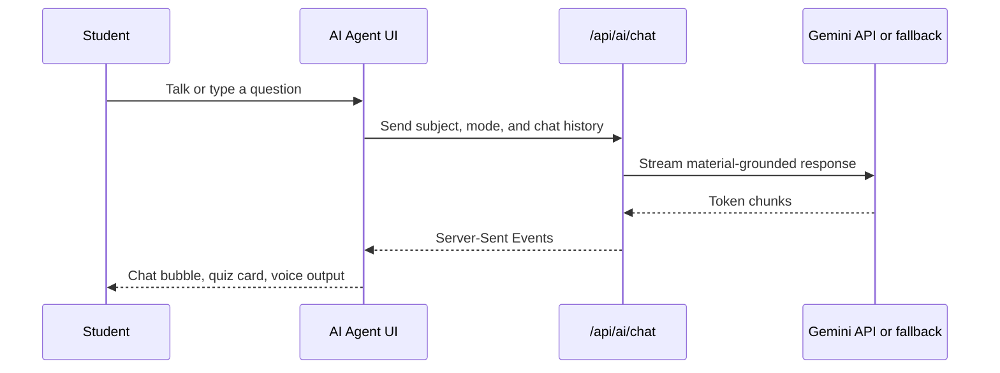
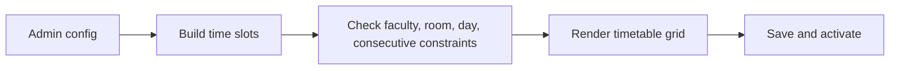

# CampusIQ

CampusIQ is an AI-native campus operating system for students, faculty, and administrators. It combines attendance intelligence, faculty workflows, principal-level analytics, voice-driven study assistance, and timetable generation in one polished hackathon-ready platform.

## Pitch

CampusIQ helps a college think, attend, learn, and lead through a single role-aware operating system.

## What Works Now

| Phase | Scope | Status |
| --- | --- | --- |
| 1 | Monorepo, auth, demo login, protected routing, design system | Complete |
| 2 | Student dashboard, attendance summaries, CSV export, schedule | Complete |
| 3 | Faculty dashboard, attendance marking, leave, materials upload | Complete |
| 4 | Admin command center, analytics, faculty/students, leave approvals | Complete |
| 5 | AI study agent, streaming chat, voice input/output, quiz cards | Complete |
| 6 | Conflict-aware timetable generator, save, activate | Complete |
| 7 | Build checks, README, demo path | Complete |

## Demo Credentials

All demo users use the same password: `campusiq123`

| Role | Email | Start Here |
| --- | --- | --- |
| Student | `student@campusiq.edu` | `/student/dashboard` |
| Faculty | `faculty@campusiq.edu` | `/faculty/dashboard` |
| Admin | `admin@campusiq.edu` | `/admin/dashboard` |

## Architecture



## Role Workflow



## AI Study Agent Workflow



## Timetable Generator Workflow



## Tech Stack

| Layer | Technology |
| --- | --- |
| Frontend | React 18, Vite, TypeScript, Tailwind CSS, React Router, Zustand |
| UI | Lucide React, Framer Motion, Recharts, custom shadcn-inspired primitives |
| Backend | Node.js, Express, TypeScript, JWT, bcryptjs, Multer |
| Data | Seeded demo services now, Prisma PostgreSQL schema ready |
| AI | Gemini Developer API free-tier path, plus local streaming fallback |
| Tooling | npm workspaces, shared TypeScript package |

## Why Gemini Instead Of Claude

Claude is excellent, but it requires paid API access. CampusIQ uses Gemini because Google documents a Gemini API free tier for testing and Google AI Studio usage as free in available countries. Gemini also supports `streamGenerateContent`, so the AI agent can keep the same streaming UX.

Useful official links:

| Purpose | Link |
| --- | --- |
| Gemini pricing and free tier | [Gemini Developer API pricing](https://ai.google.dev/gemini-api/docs/pricing) |
| Free-tier rate limits | [Gemini API rate limits](https://ai.google.dev/gemini-api/docs/rate-limits) |
| Streaming API reference | [Gemini API reference](https://ai.google.dev/docs/gemini_api_overview/) |

## Repository Layout

```text
campusiq/
|-- apps/
|   |-- backend/       # Express API, services, routes, Prisma schema
|   `-- frontend/      # React Vite client
|-- packages/
|   `-- shared/        # Shared TypeScript types and Zod schemas
|-- package.json
|-- pnpm-workspace.yaml
`-- README.md
```

## Local Development

Install dependencies:

```bash
npm install
```

Run frontend and backend together:

```bash
npm run dev
```

Useful URLs:

| Service | URL |
| --- | --- |
| Frontend | `http://localhost:5173` |
| Backend health | `http://localhost:4000/health` |
| API root | `http://localhost:4000/api` |

## Environment Setup

Copy the backend example environment when database-backed or live AI features are being enabled:

```bash
cp apps/backend/.env.example apps/backend/.env
```

The app works without PostgreSQL by using seeded demo data while the Prisma schema remains ready for real persistence.

The AI Study Agent also works without an API key by using a local streaming fallback. For live free-tier AI, create a Gemini key in Google AI Studio and set:

```bash
GEMINI_API_KEY="your-key"
GEMINI_MODEL="gemini-2.5-flash"
```

## Judge Demo Path

1. Login as Student and show attendance risk, charts, schedule, and CSV export.
2. Open AI Agent, choose Data Structures, click Quiz Mode, and answer the rendered quiz card.
3. Login as Faculty, mark attendance, submit a leave request, and upload material.
4. Login as Admin, show campus health score, analytics, heatmap, and approve the pending leave.
5. Open Timetable, click Generate Schedule, confirm zero conflicts, then activate it.

## Verification

Use these before presenting:

```bash
npm run typecheck
npm run build
npm audit --omit=dev
```

## Judging Strengths

| Criterion | CampusIQ Advantage |
| --- | --- |
| UI polish | Precision dark design, role-aware dashboards, charts, motion |
| UX clarity | One login, demo tiles, protected role routing, direct workflows |
| AI depth | Material-grounded streaming tutor, voice input/output, quiz cards |
| Working logic | JWT auth, attendance math, leave approvals, timetable constraints |
| Creativity | Campus health score, AI heatmap, voice-first study agent |
